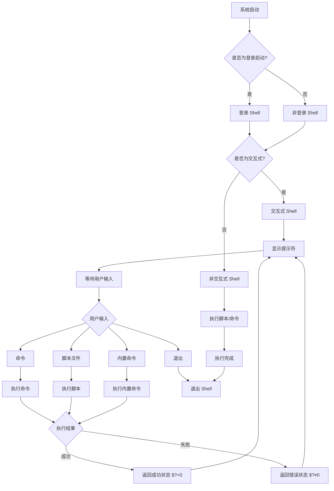
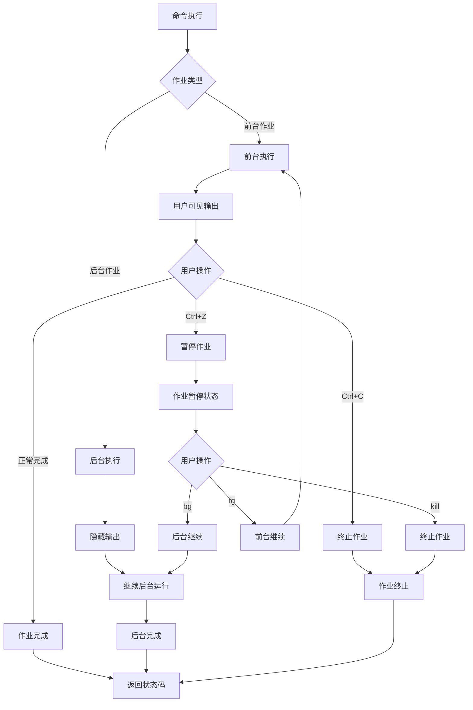
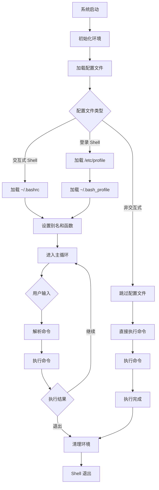
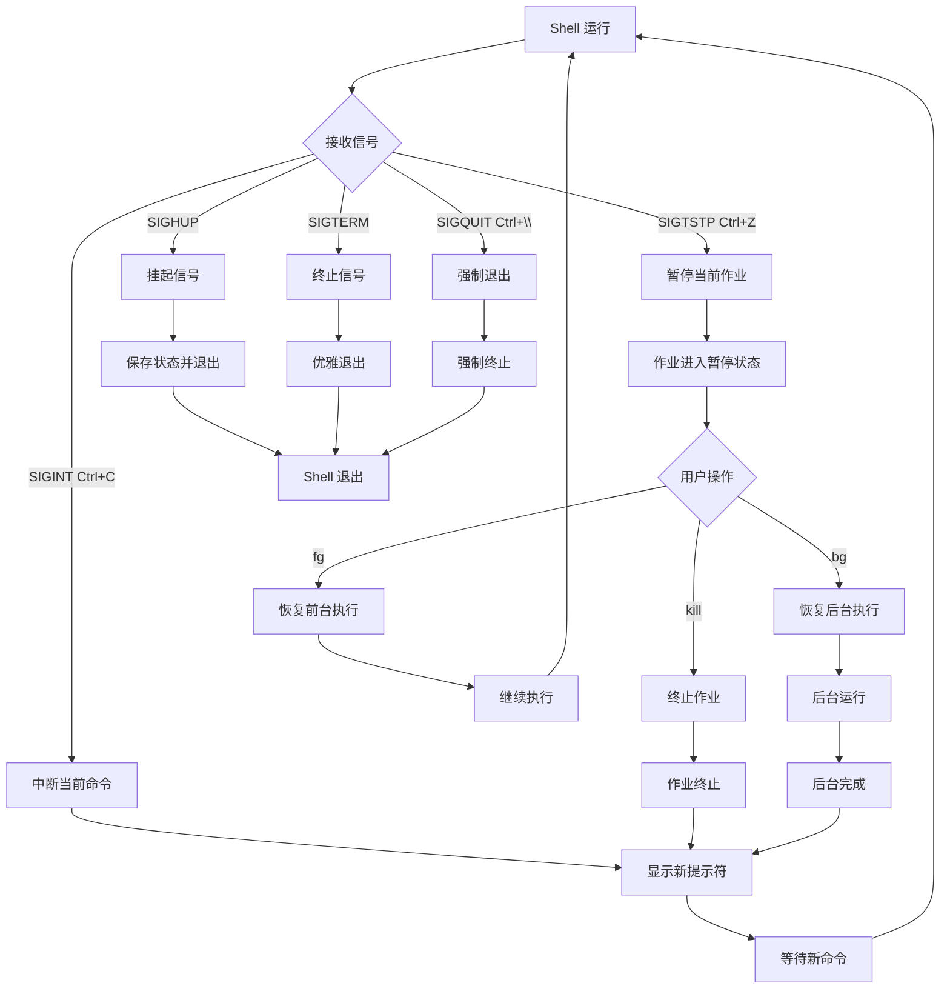
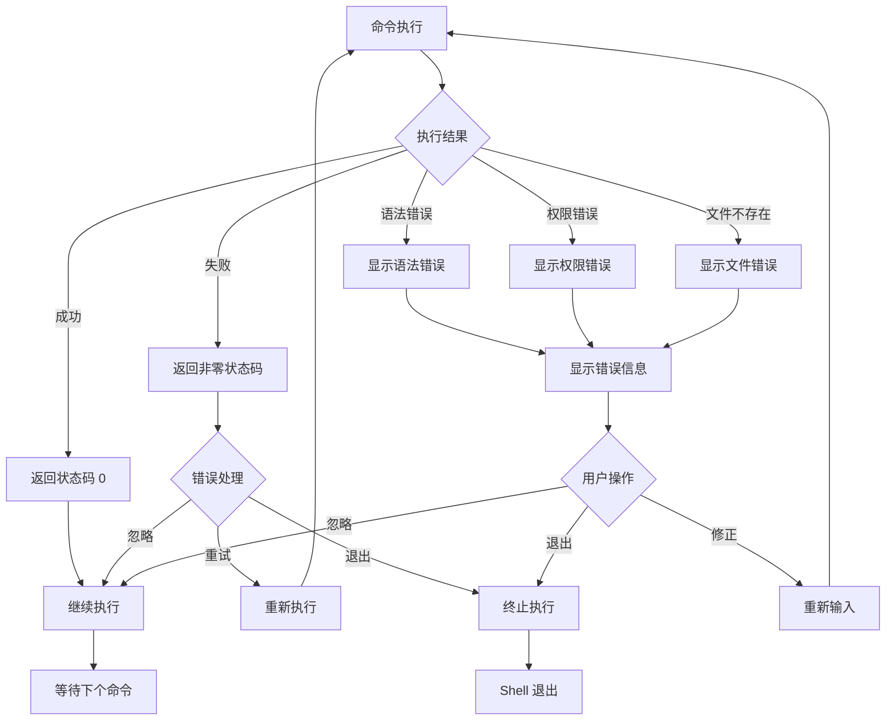

# Bash Shell 状态流程图

## 1. Shell 启动和类型状态

## 2. 作业控制状态

## 3. Shell 生命周期状态

## 4. 信号处理状态

## 5. 错误处理状态

## 状态检查命令

| 状态类型 | 检查命令 | 说明 |
|---------|---------|------|
| 交互式状态 | `[[ $- == *i* ]]` | 检查是否为交互式 shell |
| 登录状态 | `shopt -q login_shell` | 检查是否为登录 shell |
| 作业状态 | `jobs` | 显示所有作业 |
| 退出状态 | `echo $?` | 显示上一个命令的退出状态 |
| 进程状态 | `ps` | 显示进程状态 |
| 信号状态 | `trap -l` | 显示信号列表 |

## 状态转换命令

| 操作 | 命令 | 说明 |
|------|------|------|
| 前台转后台 | `Ctrl+Z` + `bg` | 暂停并后台运行 |
| 后台转前台 | `fg` | 将后台作业调到前台 |
| 终止作业 | `kill %N` | 终止指定作业 |
| 暂停作业 | `Ctrl+Z` | 暂停当前作业 |
| 退出 shell | `exit` | 退出当前 shell |
| 切换 shell | `exec bash` | 切换到 bash shell |
