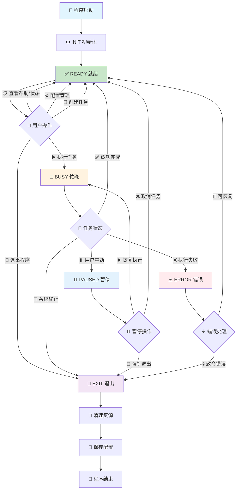
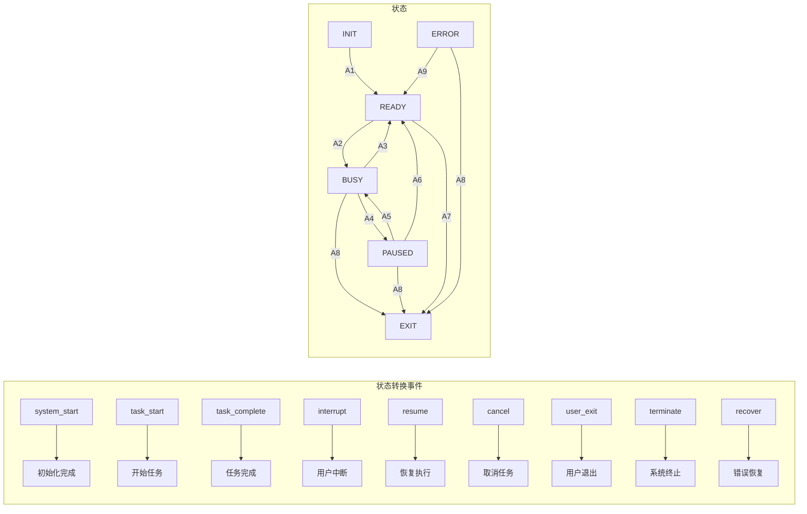
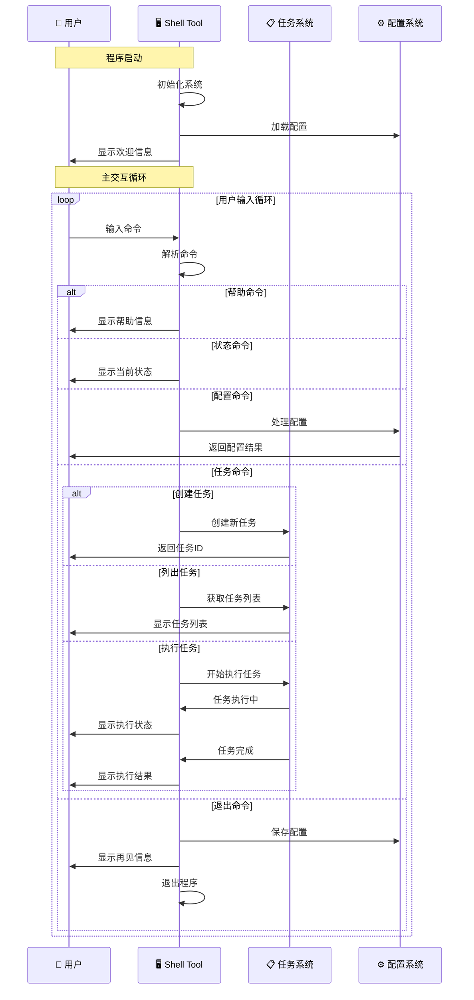
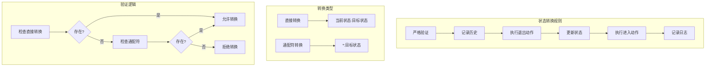

# Shell Tool 简化状态流转图

## 🎯 核心状态流转



## 🔄 状态转换事件



## 🎮 用户交互流程



## 🎯 关键状态特征

### 📊 状态特征表

| 状态 | 图标 | 特征 | 可执行操作 | 用户交互 |
|------|------|------|-----------|----------|
| **INIT** | ⚙️ | 系统初始化 | 无 | 显示初始化进度 |
| **READY** | ✅ | 等待用户输入 | 所有命令 | 完整交互 |
| **BUSY** | 🔄 | 任务执行中 | 中断操作 | 显示进度/中断 |
| **PAUSED** | ⏸️ | 任务暂停 | 恢复/取消 | 选择操作 |
| **ERROR** | ⚠️ | 错误状态 | 恢复/退出 | 错误信息 |
| **EXIT** | 👋 | 程序退出 | 清理操作 | 再见信息 |

### 🔄 状态转换规则



## 🎨 状态可视化

### 状态指示器
```bash
# 不同状态的提示符样式
INIT:   "⚙️  正在初始化..."
READY:  "✅ [READY] shell> "
BUSY:   "🔄 [BUSY] 执行中... "
PAUSED: "⏸️ [PAUSED] 已暂停 "
ERROR:  "⚠️ [ERROR] 发生错误 "
EXIT:   "👋 正在退出..."
```

### 状态颜色编码
- 🟢 **READY**: 绿色 - 系统就绪
- 🟡 **BUSY**: 黄色 - 正在工作
- 🔵 **PAUSED**: 蓝色 - 暂停状态
- 🔴 **ERROR**: 红色 - 错误状态
- 🟣 **EXIT**: 紫色 - 退出状态

## 🚀 实际运行示例

```bash
# 启动程序
$ ./shell_tool.sh

# 状态流转示例
✅ [READY] shell> task create "测试任务" "sleep 5"
📝 任务已创建: 测试任务 (ID: task_1)

✅ [READY] shell> task start task_1
🔄 [BUSY] 开始执行任务: task_1
🔄 [BUSY] 正在执行任务...
✅ [READY] 任务执行成功: task_1

✅ [READY] shell> task create "长时间任务" "sleep 30"
📝 任务已创建: 长时间任务 (ID: task_2)

✅ [READY] shell> task start task_2
🔄 [BUSY] 开始执行任务: task_2
🔄 [BUSY] 正在执行任务...
# 用户按 Ctrl+C
⏸️ [PAUSED] 任务已暂停

⏸️ [PAUSED] shell> resume
🔄 [BUSY] 任务已恢复
🔄 [BUSY] 正在执行任务...
✅ [READY] 任务执行完成

✅ [READY] shell> exit
👋 正在退出...
💾 正在保存配置...
👋 再见！
```

这个状态流转设计确保了：
- 🎯 **清晰的状态边界**: 每个状态都有明确的职责
- 🔄 **可控的状态转换**: 只有预定义的转换才被允许
- 🛡️ **完善的错误处理**: 各种异常情况都有处理机制
- 👤 **友好的用户体验**: 状态变化有清晰的视觉反馈
- 🔧 **易于扩展**: 可以轻松添加新状态和转换规则
